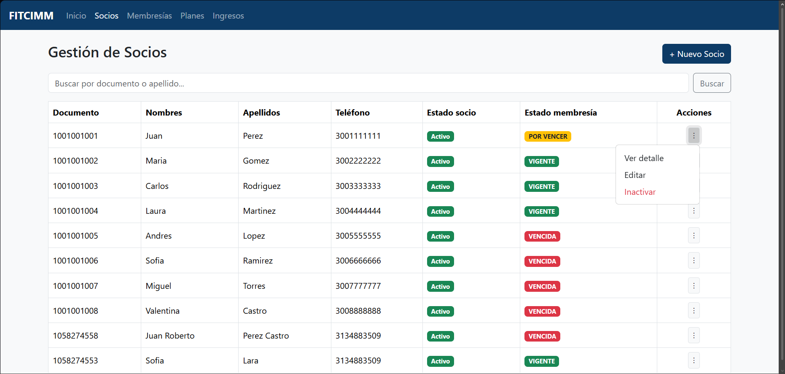
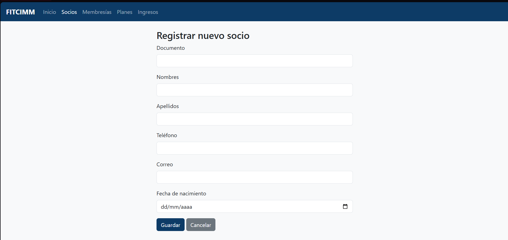
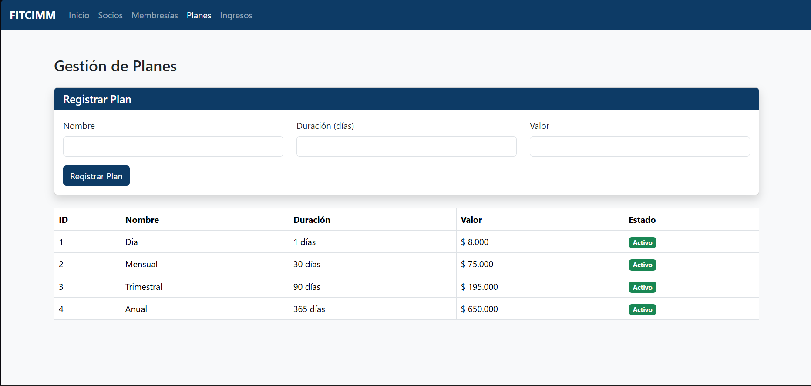
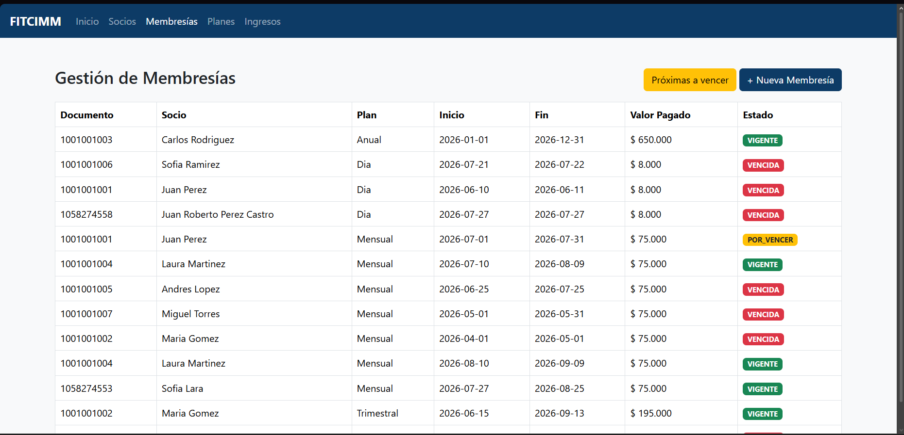
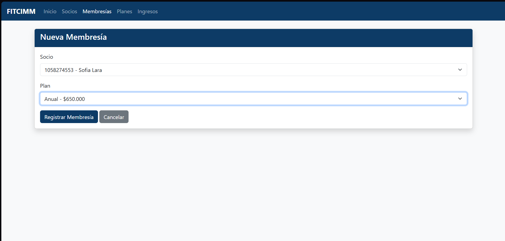
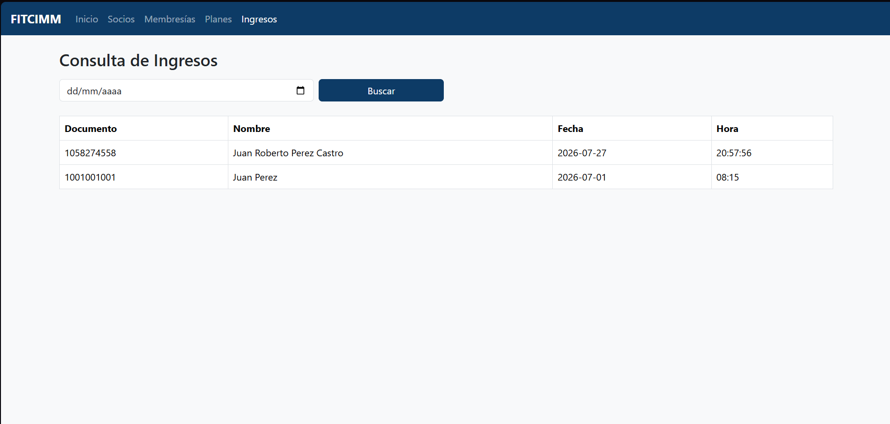
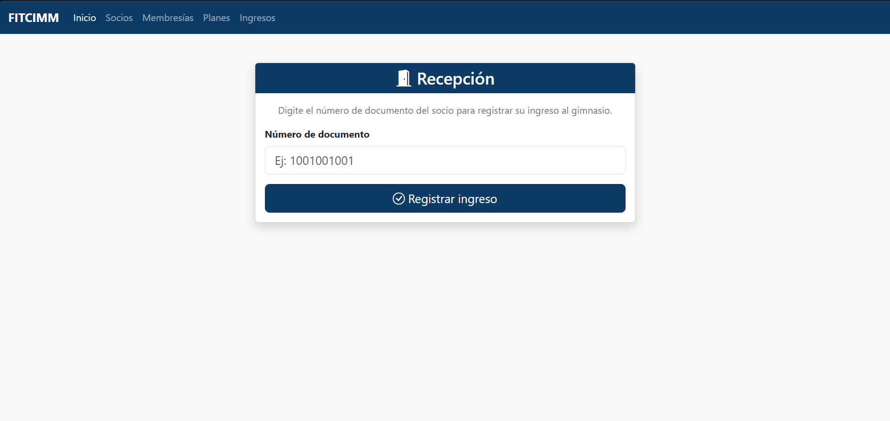
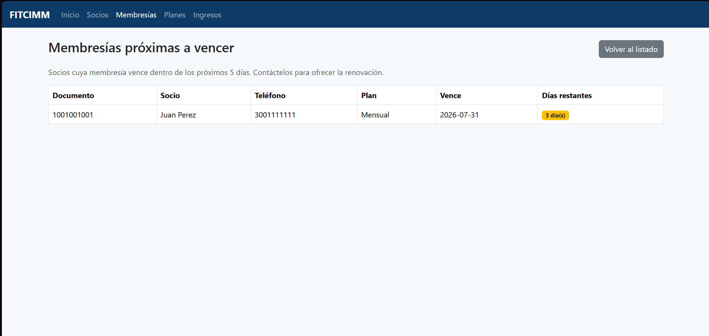
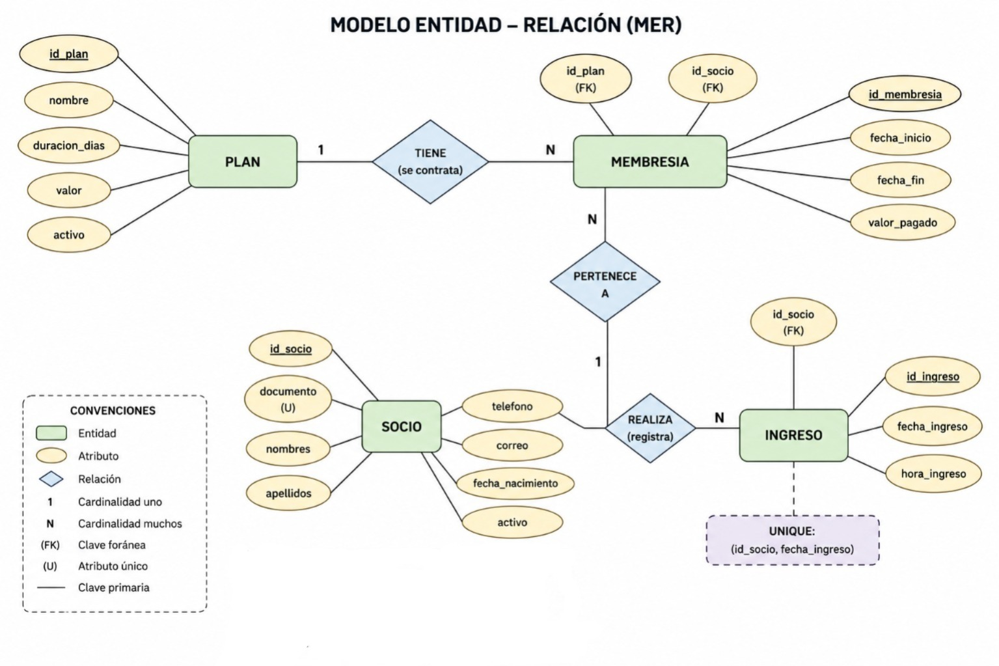

# 🏋️ FitCIMM - Sistema de Gestión de Gimnasio

Descripción del proyecto

FitCIMM es una aplicación web desarrollada como solución al problema de gestión del gimnasio FitCIMM, ubicado en el municipio de Paipa.

Antes del desarrollo del sistema, el gimnasio administraba la información de sus socios mediante un cuaderno físico y un archivo de Microsoft Excel, lo que ocasionaba inconvenientes en el control de las membresías, el ingreso de los socios y la administración de la información.

Entre los principales problemas identificados se encontraban:

- No era posible verificar de forma rápida si un socio tenía una membresía vigente, permitiendo el ingreso de personas con planes vencidos.
- No existía un mecanismo para identificar las membresías próximas a vencer, ocasionando la pérdida de posibles renovaciones.
- El administrador no contaba con información consolidada sobre los socios activos ni sobre los ingresos generados por la venta de membresías.

Para solucionar estas necesidades se desarrolló una aplicación web basada en **Java Web (Servlets y JSP)** con arquitectura por capas, la cual permite administrar la información del gimnasio de manera organizada y centralizada.

El sistema implementa los siguientes módulos:

- Gestión de socios.
- Gestión de planes.
- Gestión de membresías.
- Control de ingresos.
- Consultas y reportes administrativos.

La aplicación automatiza el cálculo del estado de las membresías, controla el acceso de los socios según su vigencia y facilita la consulta de información para apoyar la toma de decisiones del administrador.

# Funcionalidades

El sistema cuenta con los siguientes módulos:

# Gestión de Socios

- Registrar socios
- Editar información
- Inactivar socios (borrado lógico)
- Buscar por documento o apellido
- Consultar detalle del socio
- Visualizar historial de membresías

# Gestión de Membresías

- Registrar una nueva membresía
- Renovar membresías
- Cálculo automático de fecha de inicio y fecha de finalización
- Estado automático de la membresía:
  - Vigente
  - Por vencer
  - Vencida
- Historial completo de membresías
- Consulta de membresías próximas a vencer

# Gestión de Planes

- Registrar planes
- Consultar planes

Cada plan contiene:

- Nombre
- Duración en días
- Valor

# Control de Ingresos

- Registrar ingreso de un socio
- Validación automática de membresía vigente
- Consulta de ingresos por fecha
- Historial de ingresos

# Arquitectura del proyecto

Vista (JSP) | Interfaz de usuario y presentación de la información.
Controlador (Servlets) | Recibe las solicitudes HTTP y coordina el flujo de la aplicación. 
Servicio | Implementa las reglas de negocio del sistema. 
DAO | Gestiona el acceso y las operaciones sobre la base de datos mediante JDBC. 
Modelo | Representa las entidades del sistema (Socio, Plan, Membresía e Ingreso). 
Base de datos (MariaDB) | Almacena la información persistente del sistema. 

# Tecnologías utilizadas

- Java 24
- Java EE 8 Web
- JSP
- Servlets
- JDBC
- Apache Tomcat 9
- phpMyAdmin (MariaDB)
- XAMPP
- Bootstrap 5
- Maven
- NetBeans 29 

# Base de datos

El repositorio incluye:

- script.sql
- consultas.sql
- Modelo entidad-relación

# Requisitos previos

Antes de ejecutar el proyecto es necesario tener instalado:

- JDK 24
- NetBeans 29 IDE
- Apache Tomcat 9
- XAMPP (MariaDB y phpMyAdmin)
- Maven

# Instalación
# 1. Clonar el repositorio

git bash
git clone https://github.com/JUand231/FitCIMM.git

# 2. Crear la base de datos

Ejecutar:

fitcimm.sql

# 3. Ejecutar las consultas

Importar también:

consultas.sql

# 4. Configurar la conexión

Editar el archivo:
ConexionDB.java

Configurando:

- URL
- Usuario
- Contraseña

# 5. Ejecutar el proyecto

Desplegar el proyecto en Apache Tomcat y acceder desde:

http://localhost:8080/FitCimm1/socios

# Reglas de negocio implementadas

✔ Registro de socios.

✔ Validación de documento único.

✔ Inactivación lógica de socios.

✔ Administración de planes.

✔ Venta de membresías.

✔ Cálculo automático de fechas.

✔ Cálculo automático del estado de la membresía.

✔ Renovación conservando historial.

✔ Registro de ingresos únicamente con membresía vigente.

✔ Consulta de membresías próximas a vencer.

# Capturas del sistema

## Gestión de Socios

## Gestión de Planes

## Gestión de Membresías

## Registro de Ingresos

## Membresías próximas a vencer

# Modelo entidad-relación

# Autores

- Juan David Calixto Angel
- Laura Sofia Lara Herrera
